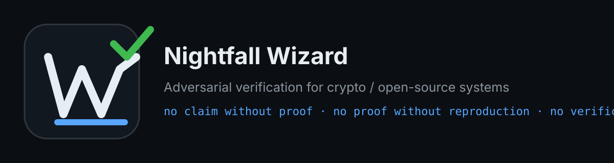

  

# Nightfall Wizard

**Independent developer focused on adversarial verification, release reality checks, and evidence-bound review workflows for crypto/open-source systems.**

## Main project

### Wizard Verification Protocol — WVP

WVP turns project claims into verifiable reality:

> No claim without proof.  
> No proof without reproduction.  
> No verification without adversarial testing.

Primary repository:  
[`nightfall-wizard/wizard-verification-protocol`](https://github.com/nightfall-wizard/wizard-verification-protocol)

## Focus

- release integrity checks
- GitHub evidence validation
- Rust/privacy-protocol review surfaces
- claim-boundary documentation
- reproducible verification workflows
- project reality classification

## Current positioning

Nightfall Wizard is not a hype account and not a financial-promotion account.

It exists to make technical claims easier to:

- verify
- reproduce
- falsify
- classify
- document with clear evidence boundaries

## Boundaries

This profile does **not** claim:

- audit status
- legal clearance
- investment quality
- custody safety
- binary safety
- full reproducible builds
- source-to-release proof
- official status for external projects

## Core rule

**A project claim is only useful when its evidence can be checked by someone else.**
